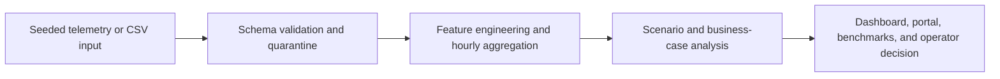

# Private 5G + Edge AI for Industry 4.0

A factory floor running 100+ AGVs over private 5G needs sub-20 ms vision decisions. The bottleneck isn't the radio — it's the edge GPU pool. Add too many AGVs and inference latency slips past the control-loop deadline. **At what fleet size does that happen?** That's the question this repo answers, with measured numbers and sensitivity.

This is the telemetry intelligence layer that sits above a private-5G + edge-AI deployment. Schemas, scenarios with named operational questions, business-case reports with sensitivity, reproducibility you can verify by re-running it yourself.

## Problem -> What I Built -> What I Found -> What I Would Do

**Problem.** A factory can add AGVs and still see healthy-looking private 5G metrics while edge inference latency quietly becomes the real constraint.

**What I built.** I built a reproducible telemetry-intelligence pipeline that joins private-5G-style KPIs, AGV fleet load, edge GPU pressure, schema validation, quarantine handling, deterministic simulation, benchmarks, and a static decision dashboard.

**What I found.** The simulated floor stayed under the 20 ms p95 budget through 100 AGVs. At 120 AGVs, the budget broke. Assembly-zone edge GPU saturation appeared first.

**What I would do.** I would cap expansion at 100 AGVs, rebalance assembly-zone workload, reserve edge GPU capacity before testing 120 AGVs, and validate with live RAN, GPU, and factory telemetry before any real deployment decision.

It does not claim live private 5G deployment, vendor RAN integration, MES/SCADA/PLC integration, or production safety certification.

| Buyer | Question | Answer in this simulation |
|---|---|---|
| **Manufacturing ops** running an AGV fleet over private 5G + edge AI | Can the floor add more AGVs without breaking the 20 ms control-loop budget? | **100 AGVs.** The 120th breaks it. |

> ▶ [**Executive dashboard**](https://obiedeh.github.io/private-5g-edge-telemetry/reports/dashboard.html) (operator capacity console) &nbsp;·&nbsp; [Portal (visual launchpad)](https://obiedeh.github.io/private-5g-edge-telemetry/reports/index.html) &nbsp;·&nbsp; [Business case](BUSINESS_CASE.md) &nbsp;·&nbsp; [One-page brief](TECH_BRIEF.md) &nbsp;·&nbsp; [Benchmarks](reports/benchmarks.md)

## Validation snapshot

- **Tests:** pytest suite passes through the `make verify` gate.
- **CI:** configured for Python 3.11 and 3.12.
- **Type/lint:** `mypy private5g_pipeline` and `ruff check .` are part of CI and `make verify`.
- **Benchmarks:** synthetic generation, schema quarantine, regeneration time, and determinism are measured in [`reports/benchmarks.md`](reports/benchmarks.md).
- **Repro command:** `make verify`.
- **Release notes:** see [`RELEASE_NOTES.md`](RELEASE_NOTES.md).

### What the data actually shows

| Worst-cell latency vs fleet | Edge GPU load by zone | Budget-violation timeline |
|---|---|---|
|  |  |  |

Worst-cell p95 latency stays under 20 ms through 100 AGVs (bars in blue), crosses over at 120 (bars in red). The assembly cell's edge GPU saturation knee — visible as the inflection in the middle plot — is where the budget breaks. Right plot scatters every individual sample across the fleet-size sweep; you can see the cloud climb past the dashed budget line as the fleet grows.

### Pipeline benchmarks (measured)

| | |
|---|---|
| **Synthetic-generator throughput** | 10,455 rows / sec (43,200 rows in 4.132 s) |
| **Schema quarantine throughput** | 168,237 rows / sec at 5% corruption - fail-soft never crashes |
| **End-to-end regeneration** | 16.124 s (both scenarios + both business cases + portal) |
| **Determinism (seed 42, two runs)** | byte-identical metrics JSON, SHA-256 verified |

Numbers come from `make benchmarks`. Full methodology + raw timings in [`reports/benchmarks.md`](reports/benchmarks.md).

---

## Architecture

The architecture is documented in [docs/ARCHITECTURE.md](docs/ARCHITECTURE.md). The runtime path is:



---

## What actually makes this hard

The practical systems problem is not just model accuracy. This telemetry layer sits between RAN KPIs, edge GPU load, and factory operations. It turns those signals into a capacity decision while keeping integration boundaries explicit. The bottleneck is:

| What | What this repo addresses | How |
|---|---|---|
| **Latency determinism** | ✓ | The manufacturing answer *is* the latency-determinism question. Worst-cell p95 vs the 20 ms control-loop deadline, with the saturation point named and the sensitivity around it measured. |
| **Data governance** | ✓ | Schema-typed ingest with fail-soft quarantine. Malformed rows route to a reasoned sink instead of crashing the pipeline. Tested under deliberately corrupted fixtures. |
| **Runtime stability** | ✓ | Deterministic seeded simulators (byte-identical re-runs). `make verify` chains lint → tests → scenarios → business cases → portal → artifact checks. CI runs the same recipe on every push. |
| **OT/IT integration (SCADA, PLC, MES)** | ✗ deferred | Boundary block — no connector here. |
| **Safety certification (IEC 62443, IEC 61508)** | ✗ deferred | Boundary block — out of scope. |
| **Continuous production-load runtime** | ✗ deferred | Seeded simulation, not a live streaming workload. |

---

## Where this fits in the stack

This is context, not an integration claim. The telemetry intelligence layer this repo demonstrates sits between private-5G-style KPIs, edge-AI workload health, and factory operations.

| Layer | Signal this repo models |
|---|---|
| **AI compute & edge AI** | Edge GPU load, inference pressure, queueing headroom |
| **Private 5G & industrial wireless** | Cell and slice KPIs, latency, jitter, handover/drop signals |
| **Factory operations** | AGV fleet size, zone-level workload, control-loop budget |
| **Decision layer** | Capacity ceiling, bottleneck attribution, sensitivity, evidence boundaries |

Nothing here claims integration with vendor deployments. What's portable is the **shape of the work**: the schema, the scenario pattern, and the way each business-case answer comes with a sensitivity story attached.

---

## How it's built

```
Raw telemetry (CSV or seeded simulator)
        │
        ▼
   schema check ─── invalid rows ──► quarantine sink
        │
        ▼
   clip, cast, engineer features
   (edge GPU load, latency pressure, spectral efficiency)
        │
        ▼
   aggregate hourly per cell × slice
        │
        ▼
   Parquet · observability JSON · operator summary MD · figures
```

Three Python subpackages sit on top:

- `scenarios/` — vertical-specific simulators that emit raw telemetry, then write per-vertical evidence packs after the data flows through the pipeline above.
- `business_cases/` — call the scenarios at parameter variations (different budgets, different thresholds, different seeds), aggregate the answers, write a one-page Markdown per buyer.
- `portal/` — render `reports/index.html` from the committed metrics JSONs.

Each layer reuses the one below it. No transform-stack duplication. No scenario duplication inside business cases.

---

## What's in the repo

- **One pipeline.** Schema-typed ingest, fail-soft quarantine for malformed rows, edge-AI feature engineering, hourly aggregation by cell × slice, Parquet outputs.
- **Manufacturing scenario.** AGV-fleet capacity over private 5G. One factory, three URLLC cells (assembly, paint, warehouse), fleet sweep from 20 to 160 AGVs. Evidence pack at `reports/scenarios/manufacturing_agv/`.
- **Manufacturing business case.** One-page Markdown with the headline answer (100 AGVs at 20 ms), a budget sweep (80 at 15 ms · 100 at 20 ms · 120 at 25 ms), a fine-grained search that pinpoints the crossover, and a four-seed stability check. At `reports/business_cases/manufacturing_agv_capacity.md`.
- **Portability cameo.** A second scenario applies the same pipeline to a non-manufacturing problem — a pharma cleanroom bioreactor watching for contamination. Same code path, different simulator, different operational question (lead time and precision instead of capacity). Lives at `reports/scenarios/pharma_bioreactor/` and `reports/business_cases/pharma_bioreactor_anomaly.md`. Not the headline, but it shows the pipeline isn't single-use.
- **Live portal.** Static HTML at `reports/index.html`, served via GitHub Pages, with cards for each artifact. Headline numbers pulled live from the metrics JSONs so the portal can't drift out of sync.
- **Pytest, mypy, ruff, and CI** cover the reproducibility path on Python 3.11 and 3.12.

---

## Quickstart

```bash
git clone https://github.com/obiedeh/private-5g-edge-telemetry.git
cd private-5g-edge-telemetry
python -m venv .venv
source .venv/bin/activate           # PowerShell: .\.venv\Scripts\Activate.ps1
pip install -e . -r requirements-dev.txt
make verify
```

`make verify` is the full reproduction gate: lint → type-check → tests → both scenarios → both business cases → portal → artifact-existence check. Same recipe CI runs on every push.

See [HOWTO.md](HOWTO.md) for step-by-step recipes.

---

## Run This Demo

```bash
make scenario-manufacturing
make business-case-manufacturing
make dashboard
make portal
```

Then open the rendered artifacts:

- [Executive dashboard](https://obiedeh.github.io/private-5g-edge-telemetry/reports/dashboard.html)
- [Visual portal](https://obiedeh.github.io/private-5g-edge-telemetry/reports/index.html)
- [Manufacturing business case](reports/business_cases/manufacturing_agv_capacity.md)

---

## Make targets

| Target | What it does |
|---|---|
| `make install-dev` | Install runtime + dev dependencies |
| `make test` | Run pytest |
| `make lint` | Run ruff |
| `make typecheck` | Run mypy |
| `make run-sample` | Sample synthetic pipeline run with full evidence bundle |
| `make scenario-manufacturing` | Generate the AGV-fleet scenario pack |
| `make scenario-pharma` | Generate the portability-cameo scenario pack |
| `make scenarios` | Both scenarios in one command |
| `make business-case-manufacturing` | Generate the manufacturing business case + sensitivity JSON |
| `make business-case-pharma` | Generate the pharma cameo business case + sensitivity JSON |
| `make business-cases` | Both business cases in one command |
| `make portal` | Build `reports/index.html` (cards view) |
| `make dashboard` | Build `reports/dashboard.html` (executive single-page) |
| `make benchmarks` | Refresh pipeline benchmarks (`reports/benchmarks.{md,json}`) |
| `make verify` | Full reproduction gate |

---

## What this is

This is a reproducible telemetry intelligence layer for evaluating private-5G-style KPIs, edge GPU pressure, AGV fleet scale, schema quality, and decision thresholds under seeded simulation.

## What this is not

- Not a live private 5G deployment.
- Not a vendor RAN integration.
- Not NVIDIA Aerial integration.
- Not MES/SCADA/PLC integration.
- Not a production safety certification artifact.
- Not measured factory telemetry.

If this is connected to measured telemetry later, the GPU-load coefficient, latency saturation knee, drift rates, and event signal amplitudes will need re-fitting. The structure of the question stays portable: what is the operational limit, and how does it move when assumptions shift?

---

## Companion repos

| Repo | Layer of the stack |
|---|---|
| [`wireless-link-intelligence-system`](https://github.com/obiedeh/wireless-link-intelligence-system) | AI-for-RAN at the PHY layer — channel estimation, OFDM, INT8 ONNX, Jetson |
| [`ai-ran-kpi-forecasting`](https://github.com/obiedeh/ai-ran-kpi-forecasting) | AI-for-RAN at the operational layer — Non-RT RIC rApp pattern |
| [`neural-receiver-5g-nr`](https://github.com/obiedeh/neural-receiver-5g-nr) *(scaffold)* | DeepRx-style neural receiver on Sionna |
| **this repo** | **Edge AI telemetry over private 5G — Industry 4.0 vertical use cases** |

The four together cover PHY → operational → vertical for private-5G + AI work in manufacturing.

## License

MIT.
