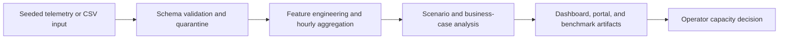

# Architecture

`private_5g_pipeline` is a simulation/data-first telemetry pipeline for private 5G KPI engineering. It is positioned for AI-RAN feature generation, edge AI observability, and telecom data product scaffolding without claiming live 5G integration.

## Package Boundaries

- `ingestion.py`: CSV ingestion and deterministic synthetic private 5G telemetry generation.
- `schema.py`: telemetry column contract and validation result types.
- `validation.py`: schema checks and row quarantine.
- `features.py`: KPI casting, AI-RAN features, edge latency pressure, and hourly aggregation.
- `export.py`: Parquet export plus JSON and Markdown reporting.
- `cli.py`: config loading, pipeline orchestration, and command-line interface.

## Data Contract

The required raw telemetry fields are:

- `timestamp`
- `cell_id`
- `slice_type`
- `prb_utilization_dl`
- `prb_utilization_ul`
- `latency_ms`
- `throughput_mbps`
- `ue_count`

Optional fields such as `sinr_db`, `rsrp_dbm`, `edge_inference_load`, `handover_count`, `drop_rate`, and `jitter_ms` enrich observability and feature generation.
