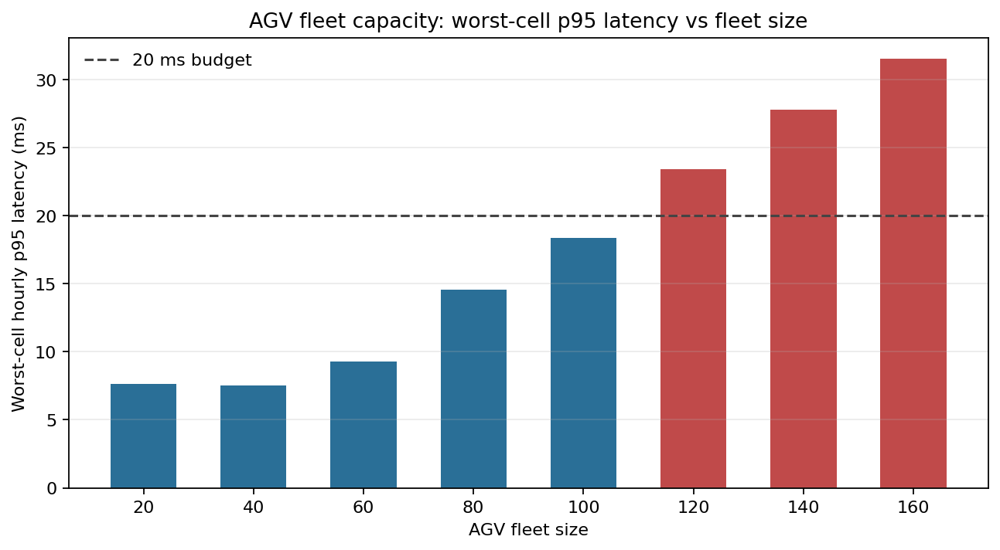
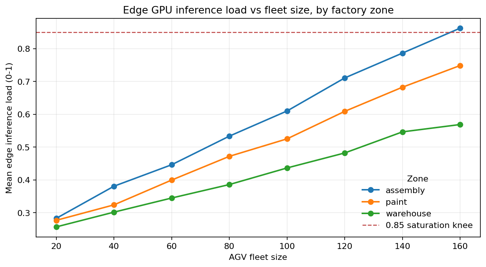
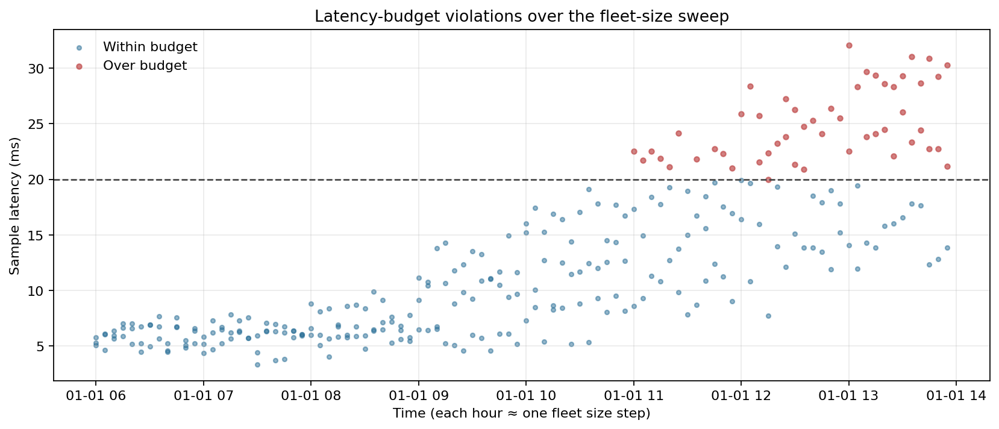

# Manufacturing — AGV fleet capacity over private 5G

A factory floor running edge-AI vision on AGVs over private 5G. Ops wants to grow
the fleet. The radio isn't the bottleneck — the edge GPU pool feeding inference to
the AGV cameras is. Add too many AGVs and vision latency slips past the 20 ms
control-loop deadline. So: how many AGVs? The same deployment shape sits across the
Industry 4.0 stack — NVIDIA-led AI compute, Ericsson and Nokia private wireless,
Siemens and Rockwell on the automation side. The question is the same regardless of
which vendors land in your specific deployment.

## What we asked

Can the floor add more AGVs without breaking the 20 ms control-loop budget?

## What we found

**100 AGVs.** That's the largest fleet where the worst cell's hourly p95 latency
stays at or below 20 ms. The assembly zone hits saturation first — it's
the busiest zone, so its cell's GPU pool runs out of headroom before the others.
Beyond that point latency climbs and drop rate starts to bite.

## Per-fleet summary

| Fleet size | Worst-cell p95 (ms) | Mean p95 (ms) | Mean edge load | Mean drop rate | Budget |
|---:|---:|---:|---:|---:|:---|
| 20 | 7.62 | 7.09 | 0.27 | 0.42 % | ok |
| 40 | 7.53 | 7.28 | 0.34 | 0.60 % | ok |
| 60 | 9.29 | 8.10 | 0.40 | 0.55 % | ok |
| 80 | 14.56 | 10.67 | 0.46 | 0.53 % | ok |
| 100 | 18.39 | 14.17 | 0.52 | 0.48 % | ok |
| 120 | 23.40 | 18.47 | 0.60 | 0.66 % | over |
| 140 | 27.78 | 22.18 | 0.67 | 0.47 % | over |
| 160 | 31.51 | 24.81 | 0.73 | 0.63 % | over |

## Figures

## What we tested, what we didn't

We tested:

- One factory site, three URLLC cells (assembly, paint, warehouse).
- AGV share by zone: assembly 42%, paint 34%, warehouse 24%.
- A GPU model where each AGV adds 1.0% load to its cell, and
  latency is flat until edge load crosses 0.40, then rises at
  50 ms per unit of over-budget load.
- A drop-rate model that picks up sharply once edge load passes 0.85.

We didn't test against real telemetry from any factory or vendor edge platform.
Plugging in measured data would shift the coefficients above. The shape of the
question — *there's a fleet size beyond which the budget breaks* — is what's portable.
