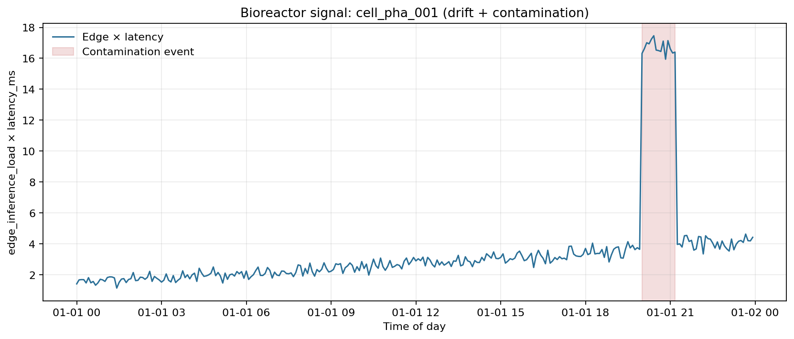
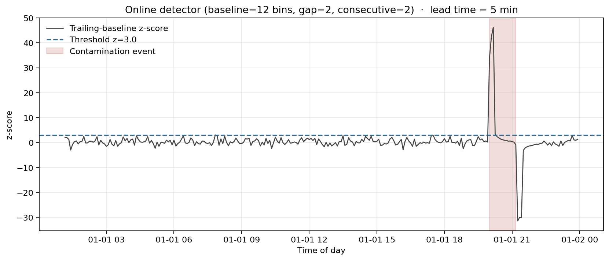
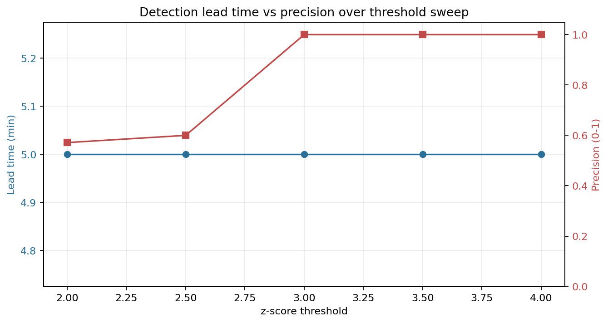

# Pharma — bioreactor anomaly detection

A pharma cleanroom is monitoring a bioreactor over private 5G. Sensors drift
slowly across the shift. Late in the day a contamination event starts. The on-cell
computer-vision model picks it up. The question for QA: how fast does the
detector tell the line, and how often does it cry wolf during the calm hours?

## What we asked

How early does the detector catch the event, and at what precision?

## What we found

At z = 3.0 on the `edge_inference_load × latency_ms`
signal (trailing 1-hour baseline with a 10-minute gap before the test
sample, fires on 2 consecutive bins over threshold), the detector
fires ****5 minutes after onset** (precision = 1.00)** on `cell_pha_001`. Across the rest of the day —
drift only, no real anomaly — it stays quiet.

## Threshold sensitivity

| z-threshold | Detected | Lead time | TP windows | FP windows | Precision |
|---:|:---:|---:|---:|---:|---:|
| 2.0 | yes |    5 min | 4 | 3 | 0.57 |
| 2.5 | yes |    5 min | 3 | 2 | 0.60 |
| 3.0 | yes |    5 min | 3 | 0 | 1.00 |
| 3.5 | yes |    5 min | 2 | 0 | 1.00 |
| 4.0 | yes |    5 min | 2 | 0 | 1.00 |

Loosen the threshold and the detector picks up more drift noise as false alarms.
Tighten it and you keep precision clean without sacrificing lead time on this signal.

## Figures

## What we tested, what we didn't

We tested:

- One cleanroom site, two URLLC cells (`cleanroom_A`, `cleanroom_B`).
- 24 hours of telemetry at 5-minute bins, seeded so two runs match exactly.
- Slow drift in SINR, jitter, and edge load on both cells through the day.
- One ~75-minute contamination event on `cleanroom_A` starting at hour 20.
- An online z-score detector on the edge × latency signal. We use a trailing
  baseline with a 10-minute gap before the test sample — without that
  gap, the first spike instantly inflates σ and the rest of the event gets buried.

We didn't test against real cleanroom telemetry, MES integration, or any vendor's
computer-vision model. Real data would change the drift rates, the event signature,
and the right baseline window. The shape of the question — *how does threshold trade
off against false-positive cost?* — is what stays portable.
